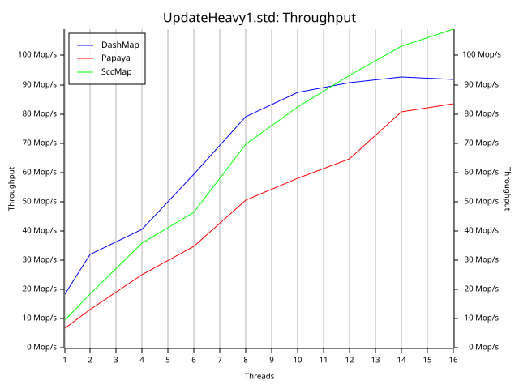
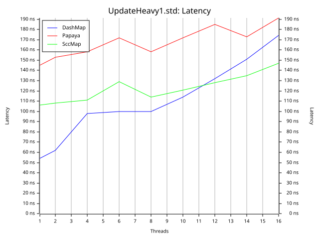
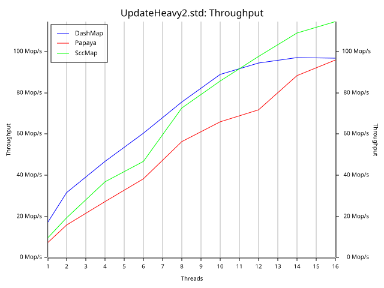
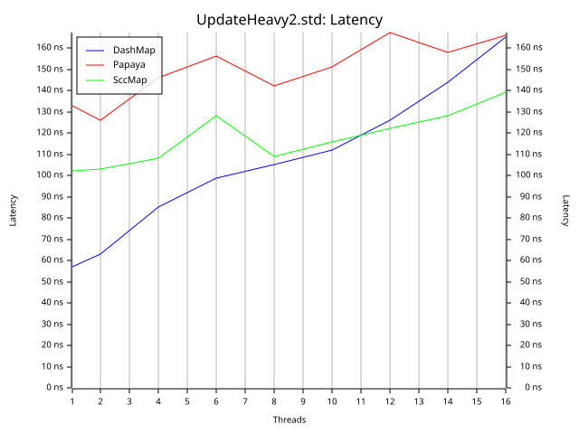

# conc-map-bench

conc-map-bench uses the bustle benchmarking harness. This is a port of the well regarded libcuckoo benchmark.

## Workloads

The benchmark measures performance under varying load conditions. This is done
because a map suitable for one workload may not be suitable for another.

### Update Heavy 1

```
read   10%
insert  5%
remove  5%
update  80%
```

### Update Heavy 2

```
read    45%
insert  5%
remove  5%
update  45%
```

## Results

Machine: Apple M3 Max

OS: macOS 14.3

See the `results/` directory.

<!-- ### Read Heavy (std hasher)
| | |
:-------------------------:|:-------------------------:
 | 

### Exchange (std hasher)
| | |
:-------------------------:|:-------------------------:
 | 

### Rapid Grow (std hasher)
| | |
:-------------------------:|:-------------------------:
 | 

### Read Heavy (ahash)
| | |
:-------------------------:|:-------------------------:
 | 

### Exchange (ahash)
| | |
:-------------------------:|:-------------------------:
 | 

### Rapid Grow (ahash)
| | |
:-------------------------:|:-------------------------:
 |  -->

### Update Heavy 1 (std hasher)
| | |
:-------------------------:|:-------------------------:
 | 

### Update Heavy 2 (std hasher)
| | |
:-------------------------:|:-------------------------:
 | 
